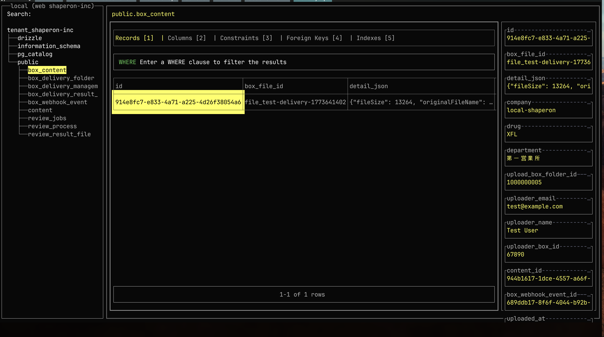
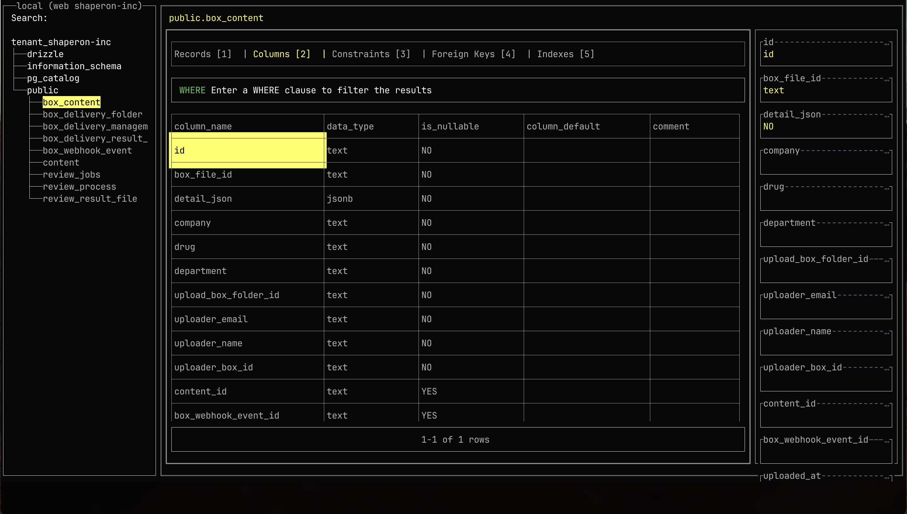
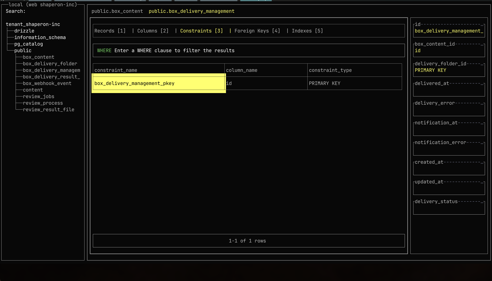
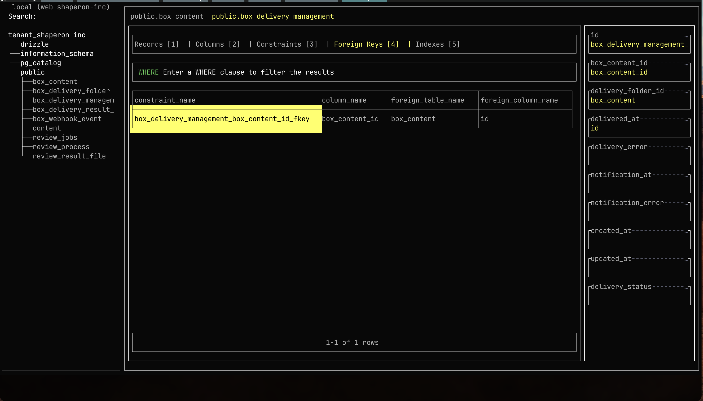
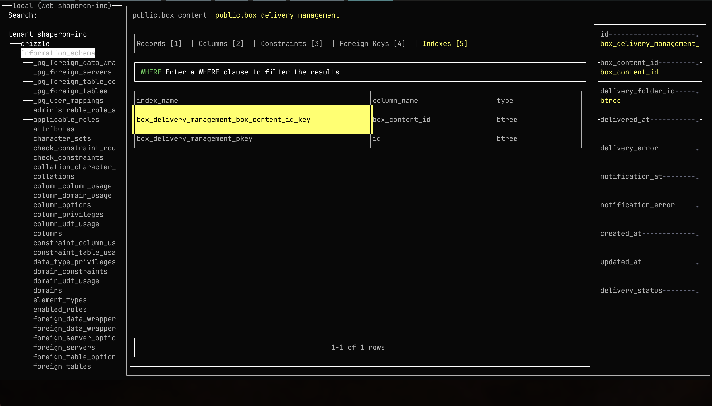

# lazysql UI ベンチマーク

lazysql（https://github.com/jorgerojas26/lazysql）のUI参考画像。

## 画面構成

lazysqlは3ペイン構成:
- **左サイドバー**: データベース/スキーマ/テーブルのツリービュー
- **メインエリア**: タブ切り替え式のデータ表示（Records / Columns / Constraints / Foreign Keys / Indexes）
- **右サイドバー**: 選択行のプロパティパネル（カラム名: 値の一覧）

## スクリーンショット一覧

### 01. Records タブ

- テーブルのレコードデータを表示
- 選択行が黄色でハイライト
- WHEREフィルタ入力欄あり
- 右サイドバーに選択行の全カラム値を表示

### 02. Columns タブ

- column_name / data_type / is_nullable / column_default / comment を表示
- 右サイドバーには選択カラムの詳細（カラム名とデータ型）

### 03. Constraints タブ

- constraint_name / column_name / constraint_type を表示
- 右サイドバーにはテーブルのカラム一覧と制約情報

### 04. Foreign Keys タブ

- constraint_name / column_name / foreign_table_name / foreign_column_name を表示
- 参照先テーブル・カラムが明示される

### 05. Indexes タブ

- index_name / column_name / type を表示
- 左サイドバーではinformation_schemaのテーブル一覧も展開可能

## 特徴的なUI要素

- テーブル名はヘッダーに `public.テーブル名` 形式で表示
- タブにはレコード数やカラム数がバッジ表示（例: `Records [1]`, `Columns [2]`）
- 選択行/セルは黄色背景でハイライト
- 右サイドバーのプロパティは罫線で区切られたカード形式
- ステータスバーに `1-1 of 1 rows` のようなページネーション情報
